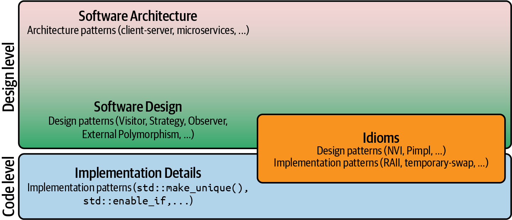

---
title: Clean Code SOLID
subtitle: Foundations of the SOLID Principles
...

# Pre-work

* Video: <https://cleancoders.com/episode/clean-code-episode-8>
* Exam: <https://cleancoders.com/episode/clean-code-episode-8/exam>

# Chapters

::: columns

:::: column

| Chapter                       | Time  |
|-------------------------------|-------|
| Overview                      | 00:44 |
| Special Relativity            | 04:45 |
| The Source Code is the Design | 11:14 |
| Design Smells                 | 20:04 |
| Rigidity                      | 20:33 |
| Fragility                     | 23:06 |
| Immobility                    | 24:43 |
| Viscosity                     | 26:07 |
| Needless Complexity           | 27:44 |

::::

:::: column

| Chapter               | Time  |
|-----------------------|-------|
| Code Rot              | 30:37 |
| Version Two           | 33:54 |
| Version Three         | 35:57 |
| Summary               | 36:51 |
| What is OO            | 37:29 |
| Dependency Inversion  | 39:15 |
| What is OO?           | 43:30 |
| Dependency Management | 46:43 |
| Conclusion            | 48:46 |

::::

:::

# Timetable

| Activity                             | Time   |
|--------------------------------------|--------|
| Warmup                               | 5 min  |
| Exercise 1                           | 15 min |
| Three levels of software development | 15 min |
| Exercise 2                           | 15 min |
| Software design goals                | 10 min |
| Exercise 3                           | 15 min |
| Wrap up                              | 5 min  |

# Warmup

* How do you manage dependencies in your code?
    - Type in the meeting chat

# Exercise 1

* Prompt
    - Share your approach to software development with the group
    - What are the similarities and differences between your approaches?
* Time limit: 15 minutes

# Discussion

* Groups to share their findings

# Three levels of software development

* Software Architecture
* Software Design
* Implementation Details

# Software Architecture

* Overall strategy of software approach
* Focuses on big decisions that are hard to change later
* Involves architectural patterns (e.g., client-server, microservices)
* Defines structure and interdependencies among key entities (modules, components)

# Software Design

* Tactics to make architecture strategy work
* Addresses interaction of software entities and dependencies
* Utilizes design patterns (e.g., Visitor, Strategy, Decorator)
* Helps break down complex systems into manageable pieces

# Implementation Details

* Most concrete level of software development
* Focuses on actual implementation of solutions
* Addresses memory acquisition, exception safety, performance, etc.
* Includes implementation patterns and language idioms (best practices)

# Idioms

* Can fall into Implementation Details or Software Design categories
* Address problems at implementation or design level
* Examples
    - C++ idioms:
        - RAII (Resource Acquisition Is Initialization)
        - Copy-and-swap idiom
        - Pimpl idiom
    - Python idioms:
        - List comprehensions
        - Context managers (with statement)
        - Decorators

# Exercise 2

* Prompt
    - Provide examples of your favorite design patterns and programming idioms
    - How do you use them?
* Time limit: 15 minutes

# Discussion

* Groups to share their findings

# Software design goals

* Design for change
* Design for testability
* Design for extension

# Design for change

* Embrace change as an inherent part of software development
* Avoid combining unrelated, orthogonal aspects to prevent coupling
* Avoid premature abstraction if you are not sure about the next change

# Design for testability

* Understand tests are your protection layer against accidentally breaking things
* Separate concerns for the sake of testability
* Consider private member functions that need testing to be misplaced

# Design for extension

* Favor design that makes it easy to extend code
* Design for code additions by all means of feature of your language
    - base classes
    - templates
    - function overloading
    - template specialization
* Avoid premature abstraction if you are not sure about the next addition

# Summary

* Treat software design as an essential part of writing software.
* Understand software design as the art of managing dependencies and abstractions.
* Consider the boundary between software design and software architecture as fluid.
* Design for easy change and make software more adaptable.
* Avoid unnecessary coupling and dependencies to make software more adaptable to
  frequent changes.

# What is next?

* Next session
    - Discussion session on the Single Responsibility Principle
    - Watch episode 9 - The Single Responsibility Principle

# Final words

> Always leave the code better than you found it.
>
> -- <cite>The Software Craftsmanship Rule</cite>
